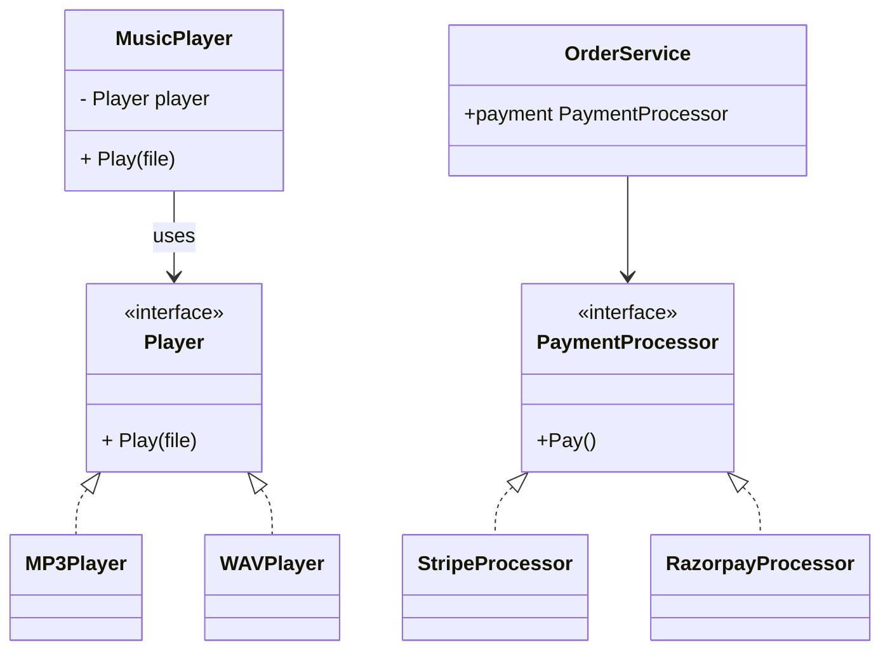
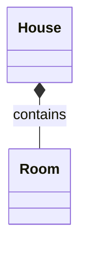

compostition : 
- It treats behaviours as independent plugins like building blocks. A `UserRepository` has a `DatabaseConnection`.  
- Flexible behavior via interchangeable components during runtime.
- Build objects by assembling small components.


Inheritance :
- `is a` relationship. `PostgresStorage` is a `BaseDatabase`


## 1. Problems with inheritance : 


1. **Tight coupling :** 
	Subclasses depend on parent internals. Changing the parent often forces changes in many children.

2. **Fragile base class :** 
	Small change in base class behavior can silently break subclasses (unexpected side-effects).

3. **Lack of runtime flexibility :** 
	Inheritance binds behavior at compile time. Swapping or combining behaviors at runtime is awkward.

4. **Deep Hierarchy issue : The Banana-Monkey-Jungle Problem**
	To quote Joe Armstrong (creator of Erlang): _"You wanted a banana but what you got was a gorilla holding the banana and the entire jungle."_ 
	As requirements evolve, inheritance trees grow deep and wide. You end up inheriting massive amounts of state and methods you don't need, muddying the API surface of your objects and wasting memory.


## 2. How composition solves these problems ?

- **Tight coupling → Loose coupling**  
    Components depend on small interfaces; implementations can be swapped without touching other code.
    
- **Fragile base class → Isolated behavior**  
    Each behavior is implemented in a focused component (single responsibility). Changing one component doesn’t ripple across unrelated classes.
    
- **No runtime flexibility → Behavior injection**  
    Inject different components at runtime (DI), or wrap objects with decorators to add behavior dynamically.
    
- **Hierarchy explosion → Reusable building blocks**  
	You compose exactly what you need. No jungle, just the banana.


## 3. "composition (design principle)" is NOT the same as UML composition/aggregation.

Computer science has a terrible habit of using the exact same word for entirely different concepts depending on the context.

#### 1. Composition : The design principle 

- Behaviour, decoupling and flexibility.
- It is a strategy of building complex system by plugging together smaller, interchangeable behavioural blocks like a lego.
- The UML representation can be association, aggregation or composition.

[watch this ](https://youtu.be/3gjSkgVOQFA?si=LdmXc8PqEDcDHCSD)

```go
type Player interface {
    Play(file string)
}

type MP3Player struct{}
func (MP3Player) Play(file string) {
    fmt.Println("Playing MP3:", file)
}

type WAVPlayer struct{}
func (WAVPlayer) Play(file string) {
    fmt.Println("Playing WAV:", file)
}

type MusicPlayer struct {
    player Player
}

func (m MusicPlayer) Play(file string) {
    m.player.Play(file)
}
```
use : 
```go
mp := MusicPlayer{player: MP3Player{}}
mp.player = WAVPlayer{}
```


#### 2. Composition : UML diagram.


- Used to Represent Data lifecycle, ownership and memory management between parent-child class.
- Represents `Has A` relationship.
	- Aggregation : weak `has a` relationship where child can exist without parent class.
	- Composition : strong `has a`  relatinship where child cannot exist without parent class.
		- Example : House and Room

```go
type Room struct {
    name string
}

type House struct {
    rooms []Room
}
```



