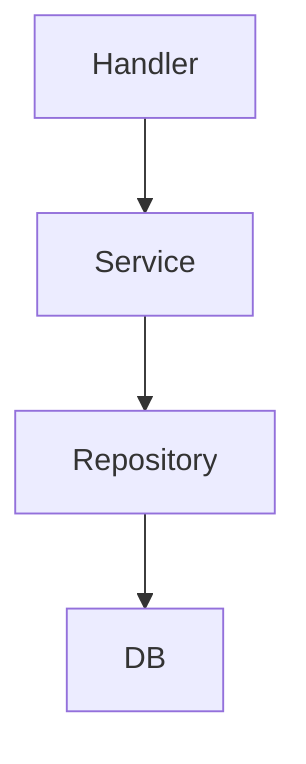

Don’t learn LLD “in Java first.” Learn design in a language-agnostic way, and think directly in Go.

# Phase 1 : Core 

## 1. Object Modeling (MOST IMPORTANT)

You should be able to:

- Identify entities
    
- Define responsibilities
    
- Avoid “God classes”
    

### Practice problems:

- Parking Lot
    
- Library System
    
- Hotel Booking
    

---

## 2. Relationships in Depth

You already started this, now master it:

- Association
    
- Directed Association
    
- Aggregation
    
- Composition
    
- Dependency
    
- Inheritance vs Composition
    

👉 Focus:

- **When to use composition over inheritance**
    
- **Lifecycle ownership (composition vs aggregation)**
    

---

## 3. SOLID Principles (Non-negotiable)

## S — Single Responsibility

- One struct = one responsibility
    
- Avoid “manager/service with 10 methods”
    

---

## O — Open/Closed

- Achieved via **interfaces + composition**
    

---

## L — Liskov

- Any implementation should work without breaking expectations
    

---

## I — Interface Segregation (VERY IMPORTANT in Go)

❌ Bad:

type Payment interface {  
    Pay()  
    Refund()  
    GenerateInvoice()  
}

✅ Good:

type Payer interface {  
    Pay()  
}  
  
type Refunder interface {  
    Refund()  
}

---

## D — Dependency Inversion (CORE GO SKILL)

type OrderService struct {  
    payment PaymentProcessor  
}

👉 Depend on interface, not struct
👉 Don’t memorize — **apply in designs**

---

## 4. UML Mastery

You should be able to:

- Draw class diagrams quickly
    
- Explain relationships clearly
    

Example mental mode

# Phase 2  : Design Patterns : 

## 1. Creational Patterns

- Factory
    
- Abstract Factory
    
- Builder
    
- Singleton (and its problems)
    

👉 Focus:

- Object creation flexibility
    

---

## 2. Structural Patterns

- Adapter
    
- Decorator
    
- Composite
    
- Facade
    

👉 Focus:

- Composition over inheritance
    

---

## 3. Behavioral Patterns (VERY IMPORTANT)

- Strategy
    
- Observer
    
- State
    
- Command
    
- Chain of Responsibility
    

👉 These are heavily used in real systems.

# phase 4 : layered architecture

### Responsibilities:

## Handler

- HTTP logic
    
- Validation
    

## Service

- Business logic
    

## Repository

- DB interaction

# phase 6 : concurrency

# phase 7 : Real systems

### Level 1:

- Parking Lot
    
- Rate Limiter (IMPORTANT)
    
- Cache (LRU)
    

---

### Level 2:

- Notification System
    
- Job Queue System
    
- API Rate Limiter (Token Bucket)
    

---

### Level 3:

- Logging Framework
    
- Distributed Worker System
    
- Pub-Sub System

