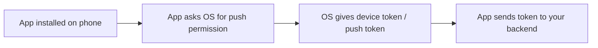
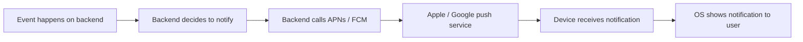
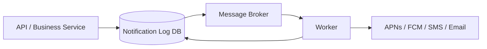
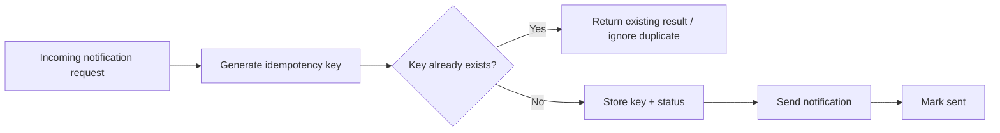
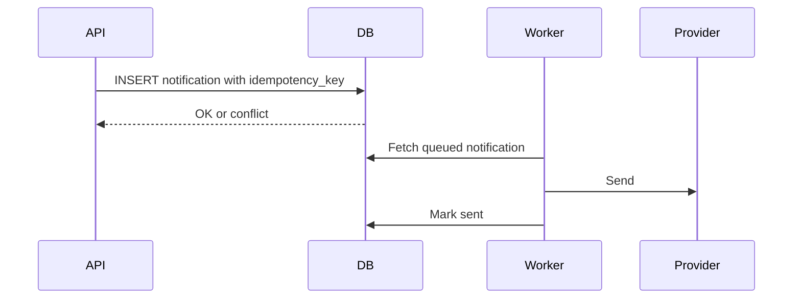
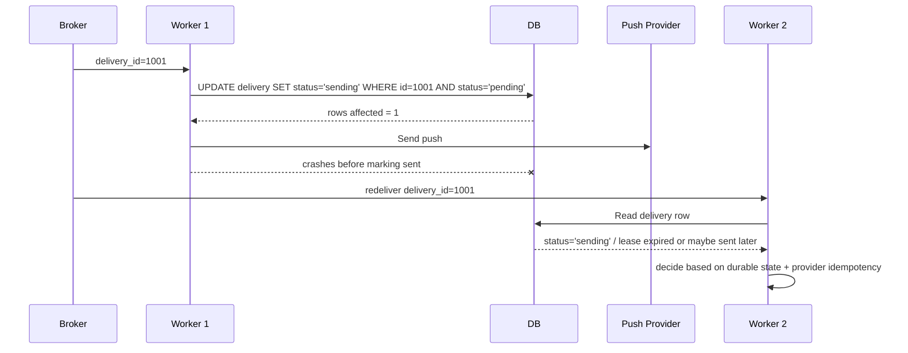
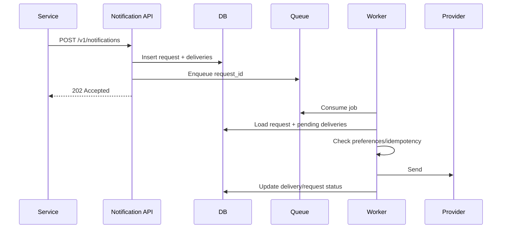
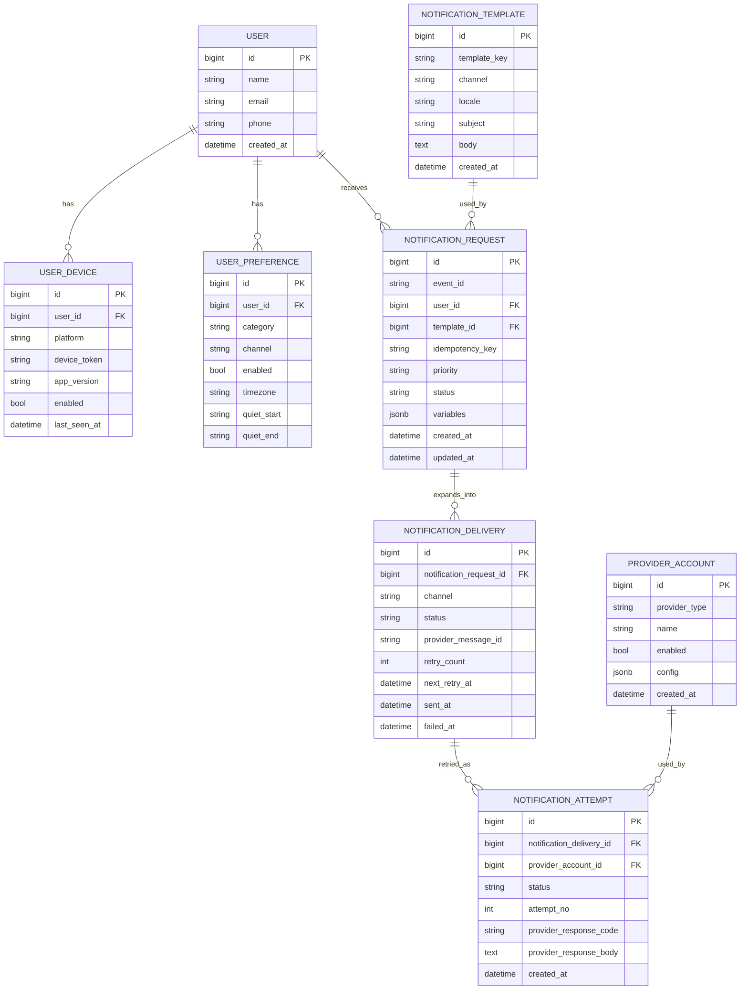
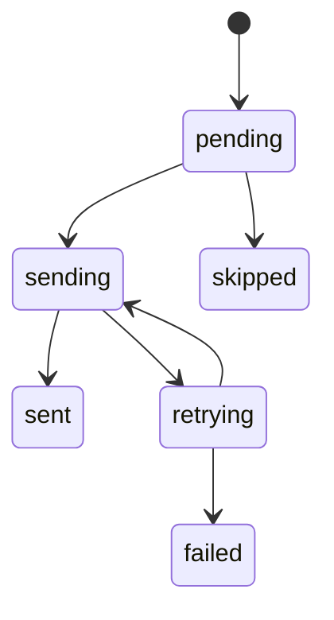
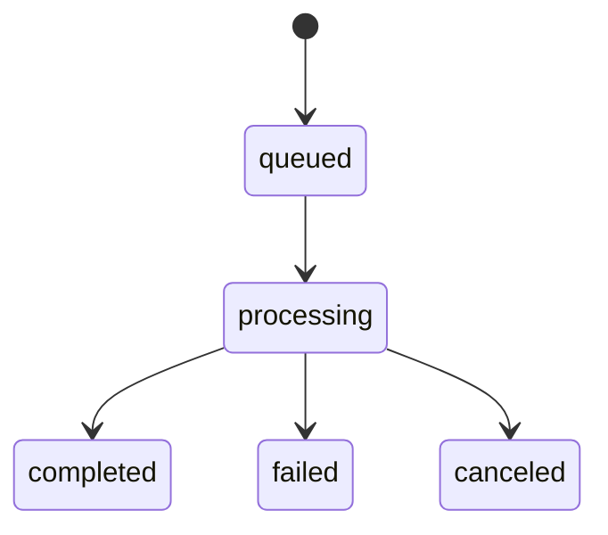

# Fundametals about notification system:
## Different types of notifications :

1. SMS :
	- Sent to a phone number through telecom providers service.
	- Works without internet in many cases.

2. Email :
	- Sent to an email inbox.
	- Require email service (smtp)
	- Cheap and easy to archive, but slower than SMS/push.

3. Push Notification :
	- Sent to a mobile device through **APNs** on iPhone or **FCM** on Android.
	- Good for app activity, reminders, promotions, chat messages.
	- Requires the app installed and notification permission.
4. Local Notification :
	- Triggered by app itself.
	- Like reminder for 7 pm, drink water

5. In-app notification ;
	- Shown only while the user is inside the app.
	- Good for activity feeds, updates, warnings, tips.
	- Not delivered outside the app.

6. Web Push notification :
	- Sent to a browser on desktop or mobile web.
	- Good for news, reminders, abandoned cart messages.
	- Works through browser permission, not email/SMS.

7. WhatsApp / messaging-app notification
	- Sent through platforms like WhatsApp Business, Telegram, Messenger, etc.
	- Good for customer support, order updates, and conversational notifications.
	- Often higher engagement than email.


![[Pasted image 20260330000912.png]]
## Push Notification : 

Push Notification is triggered by the **backend** or **server-side event**, then delivered through a **push provider** like **APNs** (Apple Push Notification) for iPhone or **FCM** (Firebase Cloud Messaging) for Android.
![[Pasted image 20260330000837.png]]

1. The App registers for Push :
	When the mobile app opens for the first time, it asks permission:
	
	- iPhone: app registers with **APNs**
	- Android: app registers with **FCM**
	
	The device gets a **push token**.
	
	That token is like the device’s address for push messages.
	
	The app usually sends this token to your backend and stores it in your database.



2. Some event happens :
	This event can come from many places:
	- user signs up
	- order is placed
	- payment succeeds
	- OTP is requested
	Your backend decides, “This user should get a notification now.”


3. Backend sends push request to provider

	Your backend does **not** usually talk directly to the phone.
	
	Instead it sends a request to:
	
	- **APNs** for iOS
	- **FCM** for Android
	
	That request includes:
	
	- device token
	- title
	- body
	- optional data payload
	- priority, sound, badge, etc.

4. Provider delivers to the phone

	Apple/Google routes the notification to the device.
	
	Then the **OS** decides what to do:
	
	- show a banner
	- show it in notification tray
	- wake the app in limited cases
	- or deliver it silently for background processing




### Example : 

#### A. Server-side event trigger

This is the most common one.

Example:

- User places an order
- Order service publishes `order_created`
- Notification service listens
- Notification service sends push:  
    “Your order has been confirmed”

This is exactly like email confirmation, just delivered through APNs/FCM.

---

#### B. Scheduled trigger

Example:

- every morning at 9 AM
- payment due in 2 hours
- reminder for today’s meeting

A cron job or queue worker checks time and sends push.

---

#### C. Client-side action causing server event

The client itself does not usually send the push.

Instead:

- user taps “Forgot password”
- app calls backend
- backend verifies request
- backend sends OTP notification or push

So the client **initiates** the event, but the server still **triggers** the push.

---

#### D. Real-time app event

Example:

- someone sends you a chat message
- someone likes your post
- your friend joins the app

Backend emits event, notification service pushes it.


# High Level Design Notification System
## 1. Understand the problem and Gather Requirements :

### 1. Contact information gathering : 

The information are stored in the DB.

1. sms - Phone number
2. email - email id
3. Push notification - Device token
	1. When the user installs the app in mobile, the app ask permission to send notification from the OS and it stores it in the DB. 
	2. User contact is a seperate table with a foreing key relationship with the user table.

Phone number and email are taken during sign up process and are stored in the users table.


### 2. Third Party services : 

In order to send sms, email or push notification we use third party services.
SMS - Telcom service
Email - Mail server like gmail, zoho, mailgun, resend etc
Push Notification : FCM, APN

### 3. Estimate scale

If the scale is few thousand than a simple high level design will work but to support millions of notifications require a highly scalable distributed system.


### 4. API and payload

POST `https://api.example.com/v/email/send`
Request Body :
![[Pasted image 20260330013002.png]]


## 2. Propose High Level Design and get appoval:


![[Pasted image 20260330004120.png]]

1. **Service 1 to N :**
	1. A service can be a micro-service, a cron job or a distributed system that triggers notifications sending events using API provided by the notification system.
		1. Example : Payment service sends email on success payment by calling an API with relevant body data.
2. **Notification System :**
	1. The notification system is the server used to send notifcation. 
	2. Currenly we just have one node of it, later we can scale to avoid SPOF.
	3. Exposes API to send notification.
	4. Builds notification payload for third party services using templates.


3. **Third-party services :**
	1. Used for sending the notifications.
	2. Should be extensible which means a flexible system that can easily plug or unplug services. So that we a service goes down, we can easily plug in an alternative. 

4. **IOS, Android, SMS, Email** : These are the consumers which receives the notification.


### **Problems in this design :**

1. **Single Point Of Failure (SPOF) :**
	1. Currently we have one notification server and if it goes down then the entire system fails.
2. **Tight synchronous coupling**
	1. Every service depends directly on the notification system. 
		1. 
	2. That means if notification is slow, down, or overloaded, your business services start feeling it too.
	3. Example:
		- `OrderService` creates an order
		- it waits for Notification System
		- Notification System waits for FCM or email provider
		- now your order flow becomes slow for no business reason
3. **Notification service is doing everything : God service** breaks single responsibility principle
	The notification system is doing:
	- routing
	- template rendering
	- provider calls
	- retries
	- persistence : database and cache
	- user preference checks
	- channel selection

4. **No Queue : System will break under load**
	If 1,000 events come in at once:
	- the system has no buffer
	- the notification service gets hammered immediately
	- third-party API latency makes it worse
	Adding a Queue will make it asynchronous.
	Handle burst request
	handle retry


5. **No retry/DLQ**
	You need:
	- retries with backoff
	- dead-letter queue
	- failure tracking

## 3. Improved High Level Design :

1. Move the database and cache out of the notification server.
2. Add more notification servers and set up automatic horizontal scaling.
3. Introduce message queues to decouple the system components.
	1. The workers pull the jobs and process it.
	2. The Queue absorbs burst.


![[Pasted image 20260330012409.png]]

1. **Service 1 to N:** 
They represent different services that send notifications via APIs provided by notification servers. 
2. **Notification servers:** They provide the following functionalities: 
	1. Provide APIs for services to send notifications. Those APIs are only accessible internally or by verified clients to prevent spams.
	2. Carry out basic validations to verify emails, phone numbers, etc. Query the database or cache to fetch data needed to render a notification. 
	3. Put notification data to message queues for parallel processing.
3. **Cache :**
	1.  User info, device info, notification templates are cached.
4. **DB :**
	1. It stores data about user, notification, settings, etc.
5. **Message queues:**
	1. They remove dependencies between components. Message queues serve as buffers when high volumes of notifications are to be sent out. Each notification type is assigned with a distinct message queue so an outage in one third-party service will not affect other notification types
6. **Workers :**
	1. Workers are a list of servers that pull notification events from message queues and send them to the corresponding third-party services.
7. **Third-party services** : 
8. **Devices** : Clients that receives the notifications.


### How these components works together to send a notification: 

1. A service calls APIs provided by notification servers to send notifications. 
2. Notification servers fetch metadata such as user info, device token, and notification setting from the cache or database. 
3. A notification event is sent to the corresponding queue for processing. For instance, an iOS push notification event is sent to the iOS PN queue. 
4. Workers pull notification events from message queues. 
5. Workers send notifications to third party services. 
6. Third-party services send notifications to user devices.


## 4. Design Deep dive :

**Till now we have discussed about :**
1. What is a notification system.
2. Different types of notification.
3. Contact info gathering.
4. Notification sending/receiving flow.


**Now we will dive deeper into**
1. Reliability :
	1. How to prevent data loss ?
	2. Will recipients receive a notification exactly once?
2. Additional component and consideration : notification template, notification settings, rate limiting, retry mechanism, security in push notifications (authorization), monitor queued notifications and event tracking.


### Reliability : 

#### 1. How to prevent data loss ?

We dont want to loose a request to send a notification.

**When data loss can happen ?**
	1. Order is placed
	2. Backend creates a notification: “Your order is confirmed”
	3. System tries to send it to APNs/FCM/email
	4. Server crashes in the middle
	If that notification was only in memory, it is gone forever.
	That is the data loss they are talking about.


**How we can persist the notification ?**
	Before sending, **persist the notification first**.
	That usually means:
	1. Receive notification request
	2. Write it to a database or durable queue
	3. A worker reads it later
	4. Worker sends it to the provider
	5. Update status in DB
![[Pasted image 20260330102536.png]]
The “notification log” is basically a **durable record of notification intent and status**.


1. write notification record to DB
2. enqueue job
3. worker sends notification
4. update DB with final status


**Benefits of storing Notification Logs :**
	1. Source of Truth and debugging
		1. Now we can answer : what happened, why it failed, did we retry 
		2. Check the status of the notification ; pending, success, failed
		3. can be used for analytics and monitoring.
	2. Idempotency : Queues are atleast once, using itempotency we can make it at max once.
	3. Long term storage : audit logs
	4. Scheduled and cancelable notifications
		Some notifications are not “send immediately.”
		Example:
		- send reminder at 9 AM
		- cancel if user already completed action
		- suppress if user opted out
		A DB makes it easy to store future jobs and update/cancel them before execution.


#### 2. Idempotency : Will recipients receive a notification exactly once?

Without idempotency, the user can get duplicate notifications.

A common pattern is:
1. API receives notification request with idempotency key
2. DB transaction inserts row with unique key
3. Worker reads `queued` rows
4. Worker marks row `processing`
5. Worker sends notification
6. Worker marks `sent`
7. If the same event arrives again, DB unique constraint prevents duplicate creation






**Where idempotency is enforced ?**
The idempotency key is generated by the business service which makes api call.
1. Producer side : 
	When the API receives the same request twice, it should not create two jobs.
2. Consumer side
	Even if the broker redelivers the message, the worker should not send twice.
	This is the more important one, because brokers are often **at-least-once**.

**How it is done ?**
	Store the idempotency key in a table with a unique index. If duplicate insertion happens the DB will reject it.


#### The Problem :

- `OrderPlaced` event is published
- worker sends push notification
- worker crashes before it records success in notification logs.
- broker retries the same message
- worker sends the same push again



When the message is redelivered, the worker checks the DB row:

- if status is `sent` → skip
- if status is `pending` → claim and send
- if status is `sending` → check whether the lease is stale


1. Claim the job atomically :
	1. Before sending, the worker updates the row from `pending` to `sending`.
	2. That update must be atomic.
	3. 
```sql
UPDATE notification_delivery
SET status = 'sending',
    updated_at = now()
WHERE id = $1
  AND status = 'pending';
```
	If rows affected = 0, some other worker already claimed it or it was already processed.

2. send the push
	Now the worker sends the notification.
	
	At this point, the DB says:
	
	- this delivery is being processed
	- no other worker should pick it up

3. mark success :
	If provider returns success, update:
	
	- `status = sent`
	- `sent_at = now()`
	- maybe `provider_message_id = ...`


4. Lease idea :
	When claiming the job, store a `processing_until` timestamp.
	If the worker crashes, the row stays `sending`, but only until the lease expires.
	Then another worker may reclaim it.


### Addition Components :

1. **Notification templates :**
	1. A large notification system sends out millions of notifications per day, and many of these notifications follow a similar format. 
	2. Notification templates are introduced to avoid building every notification from scratch. 
	3. A notification template is a preformatted notification to create your unique notification by customizing parameters, styling, tracking links, etc.
	4. The business service sends the template ID and the variables which fills the placeholders of the template.
2. **Notification settings**
	1. settings like user intent to receive the notification.
3. **Rate Limiting :**
	1. To avoid overwhelming users with too many notifications, we can limit the number of notifications a user can receive.
4. **Retry Mechanism :**
	1. When a third-party service fails to send a notification, the notification will be added to the message queue for retrying. If the problem persists, an alert will be sent out to developers.
5. **Security and Authorization**
	1. Only authenticated or verified clients are allowed to send push notifications using our APIs. 
	2. For this we can use client ID and client secret.
6. **Monitoring and Analytics**
	1. Monitor the queue for number of message, if the number is large add more workers.
7. **Event Tracking**
	1. Notification metrics, such as open rate, click rate, and engagement are important in understanding customer behaviors. Analytics service implements events tracking.

## 5. Final Design :

![[Pasted image 20260330111601.png]]

1. Rate Limiting and auth/autho are added for security.
2. Retry mechanism to handle failure with exponential backoff strategy.
3. Notification templates : 
	1. Workers uses templates to provide consistent and efficient notification creation.
4. Monitoring and Tracking : 
	1. For system checks and failure improvement.


# Low Level Design :





## 1. Database design :

These are the main objects:
- **NotificationRequest**: the business intent to notify
- **NotificationDelivery**: one row per channel delivery
- **NotificationAttempt**: each retry attempt for a delivery
- **NotificationTemplate**: reusable content structure
- **UserDevice**: push token/device registration
- **UserPreference**: channel/category/quiet-hour preferences
- **ProviderAccount**: optional config for APNs/FCM/SMTP/SMS vendors

So the data model should answer:
- what notification was requested?
- who should receive it?
- through which channels?
- what happened during delivery?
- did we retry?
- was it duplicate?
- did the user opt out?



### Models : 

DDL :

```sql
CREATE TABLE IF NOT EXISTS notification_request (
    id BIGSERIAL PRIMARY KEY,
    event_id TEXT NOT NULL,
    user_id BIGINT NOT NULL,
    template_id BIGINT NULL,
    idempotency_key TEXT NOT NULL,
    priority TEXT NOT NULL DEFAULT 'normal',
    status TEXT NOT NULL DEFAULT 'queued',
    variables JSONB NOT NULL DEFAULT '{}'::jsonb,
    created_at TIMESTAMPTZ NOT NULL DEFAULT now(),
    updated_at TIMESTAMPTZ NOT NULL DEFAULT now()
);

CREATE UNIQUE INDEX IF NOT EXISTS ux_notification_request_idempotency_key
ON notification_request (idempotency_key);

CREATE INDEX IF NOT EXISTS ix_notification_request_user_created
ON notification_request (user_id, created_at DESC);

CREATE TABLE IF NOT EXISTS notification_delivery (
    id BIGSERIAL PRIMARY KEY,
    notification_request_id BIGINT NOT NULL REFERENCES notification_request(id) ON DELETE CASCADE,
    channel TEXT NOT NULL,
    status TEXT NOT NULL DEFAULT 'pending',
    provider_message_id TEXT NULL,
    retry_count INT NOT NULL DEFAULT 0,
    next_retry_at TIMESTAMPTZ NULL,
    sent_at TIMESTAMPTZ NULL,
    failed_at TIMESTAMPTZ NULL,
    created_at TIMESTAMPTZ NOT NULL DEFAULT now(),
    updated_at TIMESTAMPTZ NOT NULL DEFAULT now()
);

CREATE UNIQUE INDEX IF NOT EXISTS ux_notification_delivery_request_channel
ON notification_delivery (notification_request_id, channel);

CREATE INDEX IF NOT EXISTS ix_notification_delivery_status_next_retry
ON notification_delivery (status, next_retry_at);

CREATE TABLE IF NOT EXISTS notification_attempt (
    id BIGSERIAL PRIMARY KEY,
    notification_delivery_id BIGINT NOT NULL REFERENCES notification_delivery(id) ON DELETE CASCADE,
    provider_account_id BIGINT NULL,
    attempt_no INT NOT NULL,
    status TEXT NOT NULL,
    provider_response_code TEXT NULL,
    provider_response_body TEXT NULL,
    created_at TIMESTAMPTZ NOT NULL DEFAULT now()
);
```


1. notification_request

|#|Field name|Type|Constraints|Description|
|---|---|---|---|---|
|1|id|BIGSERIAL|PK, NOT NULL|Unique identifier for the notification request.|
|2|event_id|TEXT|NOT NULL|Business event identifier, such as `order_shipped_8891`.|
|3|user_id|BIGINT|NOT NULL|User who should receive the notification.|
|4|template_id|BIGINT|NULL, FK|Reference to the template used to build the message.|
|5|idempotency_key|TEXT|NOT NULL, UNIQUE|Prevents duplicate notification creation for the same business intent.|
|6|priority|TEXT|NOT NULL, DEFAULT 'normal'|Priority of the request, such as low, normal, or high.|
|7|status|TEXT|NOT NULL, DEFAULT 'queued'|Overall state of the request.|
|8|variables|JSONB|NOT NULL, DEFAULT '{}'|Dynamic values used by the template.|
|9|created_at|TIMESTAMPTZ|NOT NULL, DEFAULT now()|Time when the request was created.|
|10|updated_at|TIMESTAMPTZ|NOT NULL, DEFAULT now()|Time when the request was last updated.|

2. notification_delivery

| #   | Field name              | Type        | Constraints                 | Description                                               |
| --- | ----------------------- | ----------- | --------------------------- | --------------------------------------------------------- |
| 1   | id                      | BIGSERIAL   | PK, NOT NULL                | Unique identifier for the per-channel delivery.           |
| 2   | notification_request_id | BIGINT      | NOT NULL, FK                | Parent notification request.                              |
| 3   | channel                 | TEXT        | NOT NULL                    | Delivery channel such as push, email, or SMS.             |
| 4   | status                  | TEXT        | NOT NULL, DEFAULT 'pending' | State of this channel delivery.                           |
| 5   | provider_message_id     | TEXT        | NULL                        | Message ID returned by the external provider.             |
| 6   | retry_count             | INT         | NOT NULL, DEFAULT 0         | Number of retry attempts already made.                    |
| 7   | next_retry_at           | TIMESTAMPTZ | NULL                        | When the next retry should happen.                        |
| 8   | sent_at                 | TIMESTAMPTZ | NULL                        | Time when the provider accepted or delivered the message. |
| 9   | failed_at               | TIMESTAMPTZ | NULL                        | Time when the delivery was marked failed.                 |
| 10  | created_at              | TIMESTAMPTZ | NOT NULL, DEFAULT now()     | Time when the delivery row was created.                   |
| 11  | updated_at              | TIMESTAMPTZ | NOT NULL, DEFAULT now()     | Time when the delivery row was last updated.              |

notification_attempt

| #   | Field name               | Type        | Constraints             | Description                                       |
| --- | ------------------------ | ----------- | ----------------------- | ------------------------------------------------- |
| 1   | id                       | BIGSERIAL   | PK, NOT NULL            | Unique identifier for each send attempt.          |
| 2   | notification_delivery_id | BIGINT      | NOT NULL, FK            | Parent delivery record.                           |
| 3   | provider_account_id      | BIGINT      | NULL, FK                | Provider account used for the attempt.            |
| 4   | attempt_no               | INT         | NOT NULL                | Attempt sequence number, starting from 1.         |
| 5   | status                   | TEXT        | NOT NULL                | Result of the attempt, such as success or failed. |
| 6   | provider_response_code   | TEXT        | NULL                    | Response code from the provider.                  |
| 7   | provider_response_body   | TEXT        | NULL                    | Raw response or error message from the provider.  |
| 8   | created_at               | TIMESTAMPTZ | NOT NULL, DEFAULT now() | Time when the attempt happened.                   |

user_device

| #   | Field name   | Type        | Constraints             | Description                                         |
| --- | ------------ | ----------- | ----------------------- | --------------------------------------------------- |
| 1   | id           | BIGSERIAL   | PK, NOT NULL            | Unique identifier for the device record.            |
| 2   | user_id      | BIGINT      | NOT NULL, FK            | User who owns the device.                           |
| 3   | platform     | TEXT        | NOT NULL                | Device platform such as ios, android, or web.       |
| 4   | device_token | TEXT        | NOT NULL                | Push token used by APNs or FCM.                     |
| 5   | device_id    | TEXT        | NULL                    | Stable device identifier from the client app.       |
| 6   | app_version  | TEXT        | NULL                    | App version installed on the device.                |
| 7   | enabled      | BOOLEAN     | NOT NULL, DEFAULT true  | Whether this device can receive push notifications. |
| 8   | last_seen_at | TIMESTAMPTZ | NULL                    | Last time the device token was refreshed or used.   |
| 9   | created_at   | TIMESTAMPTZ | NOT NULL, DEFAULT now() | Time when the device was registered.                |
| 10  | updated_at   | TIMESTAMPTZ | NOT NULL, DEFAULT now() | Time when the device record was last updated.       |

user_preference

|#|Field name|Type|Constraints|Description|
|---|---|---|---|---|
|1|id|BIGSERIAL|PK, NOT NULL|Unique identifier for the preference record.|
|2|user_id|BIGINT|NOT NULL, FK|User to whom the preference belongs.|
|3|category|TEXT|NOT NULL|Notification category such as transactional, marketing, or security.|
|4|channel|TEXT|NOT NULL|Channel the preference applies to, such as push, email, or SMS.|
|5|enabled|BOOLEAN|NOT NULL, DEFAULT true|Whether this category/channel is allowed.|
|6|timezone|TEXT|NULL|Timezone used for quiet-hour evaluation.|
|7|quiet_start|TIME|NULL|Start of quiet hours.|
|8|quiet_end|TIME|NULL|End of quiet hours.|
|9|created_at|TIMESTAMPTZ|NOT NULL, DEFAULT now()|Time when the preference was created.|
|10|updated_at|TIMESTAMPTZ|NOT NULL, DEFAULT now()|Time when the preference was last updated.|

notification_template

|#|Field name|Type|Constraints|Description|
|---|---|---|---|---|
|1|id|BIGSERIAL|PK, NOT NULL|Unique identifier for the template.|
|2|template_key|TEXT|NOT NULL, UNIQUE|Stable logical name of the template.|
|3|channel|TEXT|NOT NULL|Channel this template belongs to.|
|4|locale|TEXT|NOT NULL|Language or locale, such as en or en-IN.|
|5|subject|TEXT|NULL|Subject line for email or similar channels.|
|6|body|TEXT|NOT NULL|Template body with placeholders like `{{order_id}}`.|
|7|version|INT|NOT NULL, DEFAULT 1|Template version for safe evolution.|
|8|enabled|BOOLEAN|NOT NULL, DEFAULT true|Whether the template is active.|
|9|created_at|TIMESTAMPTZ|NOT NULL, DEFAULT now()|Time when the template was created.|
|10|updated_at|TIMESTAMPTZ|NOT NULL, DEFAULT now()|Time when the template was last updated.|

provider_account

|#|Field name|Type|Constraints|Description|
|---|---|---|---|---|
|1|id|BIGSERIAL|PK, NOT NULL|Unique identifier for the provider account.|
|2|provider_type|TEXT|NOT NULL|Provider type such as apns, fcm, smtp, or sms.|
|3|name|TEXT|NOT NULL|Human-readable provider account name.|
|4|enabled|BOOLEAN|NOT NULL, DEFAULT true|Whether this provider account is active.|
|5|config|JSONB|NOT NULL, DEFAULT '{}'|Provider-specific configuration and credentials reference.|
|6|created_at|TIMESTAMPTZ|NOT NULL, DEFAULT now()|Time when the provider account was created.|
|7|updated_at|TIMESTAMPTZ|NOT NULL, DEFAULT now()|Time when the provider account was last updated.|


## 2. API design

Also attach client id and client secret in the headers for authentication.

### 1. Create Notification : 

`POST /v1/notification`

Used by business service to send notification.


**Request Payload**
```json
{
  "event_id": "order_8891_shipped",
  "user_id": 12345,
  "channels": ["push", "email"],
  "template_key": "order_shipped_v1",
  "locale": "en",
  "priority": "high",
  "idempotency_key": "order_8891_shipped_user_12345",
  "variables": {
    "order_id": "8891",
    "delivery_eta": "2 days"
  },
  "metadata": {
    "source_service": "order-service",
    "trace_id": "tr_abc123"
  }
}
```

**Response :**
```json
{
  "notification_id": 9001,
  "status": "queued",
  "created_at": "2026-03-30T10:20:00Z"
}
```

### 2. Get status of the notification :

`GET /v1/notifications/{notification_id}`

**Response**
```json
{
  "notification_id": 9001,
  "event_id": "order_8891_shipped",
  "user_id": 12345,
  "status": "processing",
  "deliveries": [
    {
      "channel": "push",
      "status": "sent",
      "provider_message_id": "apns_123"
    },
    {
      "channel": "email",
      "status": "pending"
    }
  ],
  "created_at": "2026-03-30T10:20:00Z",
  "updated_at": "2026-03-30T10:20:05Z"
}
```


### 3. register device token

`POST /v1/devices`

```json
{
  "user_id": 12345,
  "platform": "ios",
  "device_token": "a1b2c3d4e5f6",
  "device_id": "ios-device-8891",
  "app_version": "2.4.1",
  "enabled": true
}
```

### 4. Update Preferences : 


`PUT /v1/users/{user_id}/notification-preferences`
```json
{
  "channels": {
    "push": true,
    "email": true,
    "sms": false
  },
  "categories": {
    "transactional": true,
    "marketing": false,
    "security": true
  },
  "quiet_hours": {
    "enabled": true,
    "start": "22:00",
    "end": "08:00",
    "timezone": "Asia/Kolkata"
  }
}
```


### Admin/internal API: templates

`POST /v1/templates`

```json
{
  "template_key": "order_shipped_v1",
  "channel": "email",
  "locale": "en",
  "subject": "Your order {{order_id}} has shipped",
  "body": "Hi {{name}}, your order {{order_id}} will arrive in {{delivery_eta}}."
}
```


### States :

1. Delivery status


2. Notification request status.



