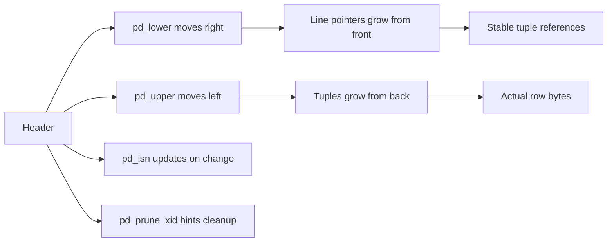

## Insert flow : 

When PostgreSQL inserts a row into a heap page:

1. It checks `pd_lower` and `pd_upper` to see if there is enough free space.
2. It stores the new tuple near the back of the page.
3. It adds or reuses a line pointer near the front.
4. It updates `pd_lower` and `pd_upper`.
5. It updates `pd_lsn` because the page changed.
6. It may set or clear flags if the page state changed.

## Update flow : 

When a row is updated:
- the old tuple may remain temporarily because of MVCC
- a new tuple version is written
- line pointers and pruning hints may change
- `pd_prune_xid` may become important

This is why the header is not just about storage. It is also about lifecycle.


## Delete flow : 

When a row is deleted:
- the tuple is not instantly removed from the page
- it becomes dead from a visibility perspective
- later pruning or vacuum may reclaim space
- `pd_prune_xid` may indicate cleanup opportunity    

So the header helps PostgreSQL decide whether the page still contains dead history that can be cleaned up.

Yes — this is the best way to make it click.

I will use a **single heap page of 8192 bytes**, and I will treat the tuple sizes as **toy sizes** so the offsets are easy to follow. In real life, tuple sizes vary.

---

# 1) Start with an empty heap page

A standard heap page begins like this:

- bytes `0..23` → page header
    
- bytes `24..8191` → free space
    
- for a heap page, `pd_special = 8192`, so there is no special space used
    

So the initial header values are:

- `pd_lower = 24`
    
- `pd_upper = 8192`
    
- `pd_special = 8192`
    

```text
offset →
0                                                     8191
+------------------------+------------------------------+
| header (24 bytes)      | free space                   |
+------------------------+------------------------------+
^                        ^                              ^
0                       24                            8192

pd_lower = 24
pd_upper = 8192
pd_special = 8192
```

The free space is:

`pd_upper - pd_lower = 8192 - 24 = 8168 bytes`

That is all usable space at the beginning.

---

# 2) Insert 1

Let the first tuple be **96 bytes**.

PostgreSQL stores tuples from the **end of the page backward**.

So this tuple goes to:

`8192 - 96 = 8096`

That means the tuple occupies:

- bytes `8096..8191`
    

A new line pointer is also needed.

A line pointer is **4 bytes**, and it is placed right after the header.

So after insert 1:

- line pointer 1 occupies bytes `24..27`
    
- `pd_lower` becomes `28`
    
- `pd_upper` becomes `8096`
    

```text
offset →
0                                                     8191
+------------------------+----+------------------+------+
| header (24 bytes)      |LP1 |   free space     | T1   |
+------------------------+----+------------------+------+
0                       24   28                8096  8192

pd_lower = 28
pd_upper = 8096
```

### What just happened

- one slot was consumed for the tuple reference
    
- one tuple was stored from the back
    
- free space shrank from both ends
    

---

# 3) Insert 2

Let the second tuple be **80 bytes**.

It goes right before the first tuple, so it starts at:

`8096 - 80 = 8016`

That means tuple 2 occupies:

- bytes `8016..8095`
    

Another line pointer is added:

- line pointer 2 occupies bytes `28..31`
    

Now:

- `pd_lower = 32`
    
- `pd_upper = 8016`
    

```text
offset →
0                                                     8191
+------------------------+--------+-----------+------+------+
| header (24 bytes)      | LP1|2  | free space| T2   | T1   |
+------------------------+--------+-----------+------+------+
0                       24      32         8016   8096 8192

pd_lower = 32
pd_upper = 8016
```

### Boundary movement

- `pd_lower` moved right by 4 bytes
    
- `pd_upper` moved left by 80 bytes
    

---

# 4) Insert 3

Let the third tuple be **112 bytes**.

It starts at:

`8016 - 112 = 7904`

So tuple 3 occupies:

- bytes `7904..8015`
    

Add one more line pointer:

- line pointer 3 occupies bytes `32..35`
    

Now:

- `pd_lower = 36`
    
- `pd_upper = 7904`
    

```text
offset →
0                                                     8191
+------------------------+------------+--------+------+------+
| header (24 bytes)      | LP1|LP2|3  | free   | T3   | T2 T1|
+------------------------+------------+--------+------+------+
0                       24           36      7904  8016 8096 8192

pd_lower = 36
pd_upper = 7904
```

Now you can already see the pattern:

- **line pointers grow from the front**
    
- **tuples grow from the back**
    
- **free space is trapped in the middle**
    

---

# 5) Delete one row

Now delete tuple 2.

Important part: **the page does not immediately compact itself**.

Usually:

- the tuple becomes dead from MVCC’s point of view
    
- the line pointer may be marked dead or reused later
    
- the bytes are still physically there until pruning/vacuum
    

So after delete:

- `pd_lower` stays `36`
    
- `pd_upper` stays `7904`
    

Only the logical state changes.

```text
offset →
0                                                     8191
+------------------------+------------+--------+------+------+
| header (24 bytes)      | LP1|LP2*|3  | free   | T3   | T2 T1|
+------------------------+------------+--------+------+------+
0                       24           36      7904  8016 8096 8192
```

Here `LP2*` means the slot is no longer pointing to a live tuple.

### Key lesson

A delete usually does **not** move the boundaries.

That surprises a lot of people at first.

---

# 6) Update one row on the same page

Now update tuple 1.

For the simplest mental model, assume this is a normal update that creates a **new tuple version** on the same page.

Let the new version be **104 bytes**.

It starts at:

`7904 - 104 = 7800`

So the new tuple occupies:

- bytes `7800..7903`
    

A new line pointer is added:

- line pointer 4 occupies bytes `36..39`
    

Now:

- `pd_lower = 40`
    
- `pd_upper = 7800`
    

```text
offset →
0                                                     8191
+------------------------+----------------+------+------+
| header (24 bytes)      | LP1|LP2*|LP3|4 | free | T4   |
+------------------------+----------------+------+------+
0                       24              40   7800  7904 8192
```

And in the full page view, the older tuples are still physically present too:

```text
offset →
0                                                     8191
+------------------------+----------------+--------+------+------+
| header (24 bytes)      | LP1|LP2*|LP3|4 | free   | T4   | T3   |
+------------------------+----------------+--------+------+------+
0                       24              40      7800  7904 8016 8192
```

Tuple 1’s old version is still somewhere in the page until cleanup removes it or reuses the space.

### Important nuance

PostgreSQL updates are governed by MVCC, so the old row version often remains until vacuum/pruning can safely deal with it.

---

# 7) What happens to the header fields during this whole story

Now connect the dots.

## `pd_lower`

Moves when line pointers are added.

It changed like this:

- start: `24`
    
- after insert 1: `28`
    
- after insert 2: `32`
    
- after insert 3: `36`
    
- after delete: `36`
    
- after update: `40`
    

### Meaning

It tracks the front edge of metadata usage.

---

## `pd_upper`

Moves when tuples are added.

It changed like this:

- start: `8192`
    
- after insert 1: `8096`
    
- after insert 2: `8016`
    
- after insert 3: `7904`
    
- after delete: `7904`
    
- after update: `7800`
    

### Meaning

It tracks the back edge of tuple storage.

---

## `pd_lsn`

Changes whenever the page is modified and WAL is involved.

So after each insert/update/delete, the page’s `pd_lsn` is advanced to match the WAL record that protects that change.

### Meaning

This is the recovery bookmark.

---

## `pd_prune_xid`

May get set or adjusted after dead tuples appear.

After the delete and update, PostgreSQL may remember:

> “This page has old tuple versions that might be worth pruning later.”

### Meaning

This is a cleanup hint, not a space boundary.

---

# 8) The easiest way to remember all of it

Here is the whole page as a living object:



## The core rule

When the page changes:

- **front side grows** because line pointers are added
    
- **back side grows inward** because tuples are added
    
- **middle shrinks** because free space is consumed
    

That is the entire page layout in one sentence.

---

# 9) A very short paper drawing you can keep in your head

```text
EMPTY PAGE

0                                                    8191
+------------------------+------------------------------+
| HEADER                 | FREE SPACE                   |
+------------------------+------------------------------+
0                       24                             8192
pd_lower=24, pd_upper=8192


AFTER 3 INSERTS

0                                                    8191
+------------------------+----------+--------+----+----+
| HEADER                 | LPs      | FREE   | T3 | T2 |
+------------------------+----------+--------+----+----+
0                       24        36      7904 8016 8096
pd_lower=36, pd_upper=7904
```

You can imagine each insert pushing:

- `pd_lower` → right
    
- `pd_upper` → left
    

---

# 10) One subtle but important correction

A delete or update does **not** immediately mean “free space moved back.”

That only happens after pruning or vacuum reclaim the space.

So the page can look “full of dead bytes” even though logically some rows are gone.

That is why Postgres pages are not just storage blocks.  
They are **MVCC-managed storage blocks**.

---

If helpful, I can next draw this as a **byte-by-byte labeled diagram with exact slot numbers and tuple offsets**, or I can show the **same example with HOT update vs normal update** so you see why updates sometimes stay on the same page without touching indexes.

## 1) Reflection on what could be improved

A side-by-side comparison of normal update vs HOT update would make the tuple/lane-pointer behavior even easier to internalize, because updates are where most confusion starts.

## 2) What you should learn next

Learn **heap tuple headers and MVCC visibility** next. That is the missing piece that explains why deleted or updated tuples still physically remain on the page.

## 3) A good exercise

Take this exact example and redraw it yourself on paper twice: once after the delete, once after the update. Label `pd_lower`, `pd_upper`, and the line pointer slots after every step.

## 4) Production-grade considerations and common pitfalls

Do not assume dead tuples immediately free page space. In real systems, fragmentation and delayed cleanup are normal, and that is one reason vacuum behavior, fillfactor, and HOT update friendliness matter so much.