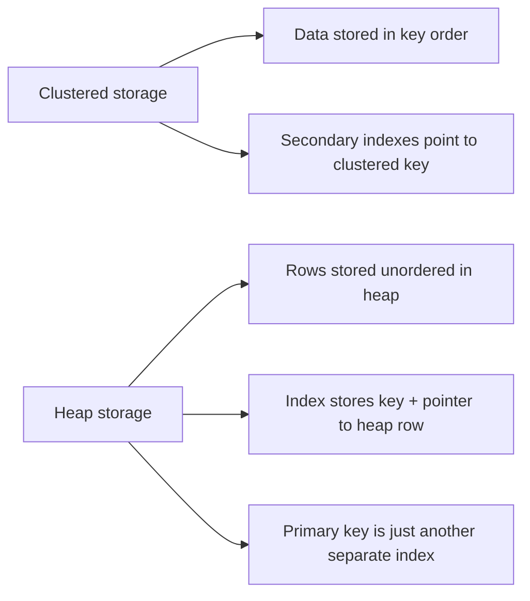

## Tables without primary key :

When a table has no primary key or any other indexes, RDBMSs typically store its data in an unordered structure called a **heap file**. In this scenario, there is no inherent sorting or organization. Records are simply appended to the first available space. This makes finding a specific record very slow, as the database must perform a **full table scan**, reading every single record to find the one it needs.


## Tables with primary key :

RDBMSs commonly use two broad table storage models and this is where PostgreSQL and MySQL’s approaches diverge.



## 1. Heap Storage :

==PostgreSQL== stores table data in a **heap**, and the table rows are kept separately from the indexes. When you define a **PRIMARY KEY**, PostgreSQL automatically creates a **unique B-tree index** for it. That index stores key values and pointers to the matching heap rows, but it does **not** store the table data itself. 

All indexes are secondary indexes relative to the heap in postgres which means when you create a secondary index, the key in the index points to the heap location where the row is present unlikely how the clustered indexing works.

All indexes are stored in a seperate file.

In PostgreSQL, **all indexes are secondary indexes**, including the primary key index, so the primary key index lives in its own physical structure separate from the heap.

TID - Is the location that points to the heap row where the data(row) is present. 
- **PostgreSQL** uses a **Tuple ID (TID)** as a pointer. A TID is a physical address that consists of a block (page) number and an offset within that page. When an index lookup occurs, it finds the TID and uses it to perform a **single random read** to retrieve the record from the heap.


In PostgreSQL, a primary key and a normal B-tree index are both separate disk structures that store search keys and heap references. The primary key index is special only because PostgreSQL automatically makes it unique and not null; physically, it still behaves like another secondary index on the heap.

```go
PRIMARY KEY  -> unique B-tree index -> heap TID -> heap row
OTHER INDEX  -> B-tree index        -> heap TID -> heap row
```


## 2. Clustered / index organized storage :

The InnoDB storage engine is an **Index-Organized Table (IOT)**. This means the primary key is not just an index; it **is** the table’s storage structure. The entire table is physically sorted and stored as a B-tree, with the full rows of data located in the B-tree’s leaf nodes. This is also known as a **clustered index**.

In this model, the primary key is usually the clustered key, and secondary indexes point to that key rather than directly to the row in the disk.


# write this properly


At the hardware level, a relational database does not understand the concept of "tables," "rows," or "columns." It only understands files, byte arrays, and disk offsets. 
The translation of a logical table into physical bytes on a storage device is governed by the **database's storage engine.**

Here is the industry-standard architecture for how databases structure and store records on disk.


### 1. Files and Segments (The Macro Level)

When a table is created, the database allocates a physical file within a specific directory (a tablespace) on the file system.

- **Heap Files:** The primary file where the actual data records (tuples) are stored in an unordered manner.
    
- **Segments:** Because operating systems have file size limits, databases split table data into multiple files called segments. For example, PostgreSQL creates a new segment file every time a file reaches 1GB.
    
- **Forks:** A single table is often backed by multiple files for different purposes: the main data file, a Free Space Map (FSM) to track available space, and a Visibility Map (VM) to track which records are visible to all transactions.
    

### 2. The Page or Block (The Unit of I/O)

The database does not read or write individual rows to the disk. Disk I/O is expensive, so storage is divided into fixed-size chunks called **Pages** or **Blocks** (typically 8KB in PostgreSQL, 16KB in InnoDB/MySQL). When an application requests a specific row, the database fetches the entire page containing that row from disk into memory (the Buffer Pool).

### 3. Slotted Page Architecture (The Micro Level)

Within an 8KB page, the database must manage multiple variable-length records. This is achieved using the **Slotted Page Architecture**, which consists of four distinct areas:

1. **Page Header (24 bytes):** Contains metadata about the page, such as the Log Sequence Number (LSN) for crash recovery, the page format version, and pointers to the start and end of free space.
    
2. **Item Pointers / Line Pointers (4 bytes each):** An array of pointers immediately following the header. Each pointer corresponds to a record and stores the memory offset and length of that record within the page. These pointers grow downwards from the top of the page.
    
3. **Free Space:** The unallocated space in the middle of the page.
    
4. **Tuples (Records):** The actual row data. These are inserted starting from the bottom (end) of the page and grow upwards.
    

This architecture prevents fragmentation when records are deleted or updated. If a record is updated and its size changes, the database writes the new record into the free space and simply updates the 4-byte Item Pointer.

### 4. Tuple Structure (The Record Level)

A single record (tuple) is not just the raw data inserted via SQL. It contains a significant amount of overhead for database operations:

- **Tuple Header (typically 23+ bytes):** Contains vital metadata, primarily for Concurrency Control (MVCC). It includes:
    
    - `t_xmin`: The Transaction ID that inserted the record.
        
    - `t_xmax`: The Transaction ID that deleted or updated the record.
        
    - `t_ctid`: A pointer to the physical location of this tuple or its updated version.
        
- **Null Bitmap:** An array of bits indicating which columns in the record are NULL, saving space by not storing actual NULL values.
    
- **User Data:** The actual column data, stored in the order defined by the schema. Fixed-length types (like `INTEGER` or `BOOLEAN`) take strict byte counts. Variable-length types (like `VARCHAR` or `TEXT`) include length headers and might be compressed or moved out-of-line (TOAST) if they exceed the page size.
    

### Example: Storing a Record

Consider the following schema and execution: `CREATE TABLE users (id INT, name VARCHAR(50));` `INSERT INTO users (id, name) VALUES (1, 'suraj');`

1. The database engine locates the table's heap file.
    
2. It consults the Free Space Map to find an 8KB page with enough room.
    
3. It loads that page into the Buffer Pool (memory).
    
4. It constructs the tuple in memory: Header (including the current transaction ID) + Null Bitmap + Data (`[1]` as a 4-byte integer, `'suraj'` as a length-prefixed string).
    
5. It writes this tuple to the bottom of the page.
    
6. It creates a 4-byte Item Pointer at the top of the page, pointing to the byte offset of the newly written tuple.
    
7. The modified page is marked as "dirty" in memory and will eventually be flushed to disk by a background writer process.
    

### 5. Indexes and TIDs

When you query `SELECT * FROM users WHERE id = 1`, scanning every page in the heap file (a Sequential Scan) is highly inefficient.

An index (like a B-Tree) stores the indexed value (e.g., `id = 1`) and a **Tuple Identifier (TID)**. A TID is a physical coordinate consisting of `[Block Number, Item Pointer Offset]`. The B-Tree allows the engine to navigate directly to the specific 8KB page and the exact byte offset of the record without scanning the rest of the disk.
