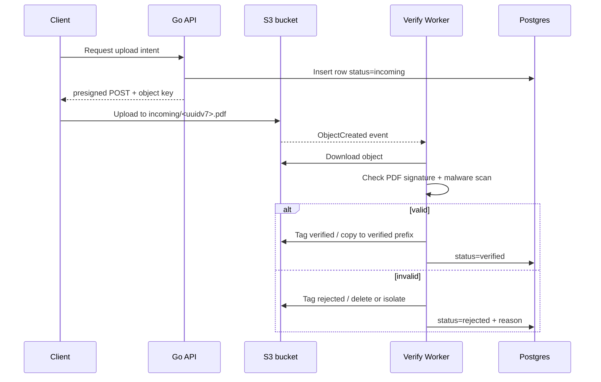

S3 validates the **request fields against the POST policy**, not the actual file. In a presigned POST, `Content-Type` is just a form field, and the policy can require an exact match or a prefix match; S3 checks that the submitted form satisfies those conditions. It does **not** inspect the uploaded bytes to prove they are actually a PDF.

So in the example, a client can upload the `malicious.exe` file while sending the required `Content-Type` , and S3 will store the object.
- A presigned POST policy can enforce the **form field** `Content-Type: application/pdf`, the object key, and the size range, but AWS describes POST policy validation as checking whether the request meets the **policy conditions**. It does **not** say S3 inspects the file bytes to confirm the object is really a PDF.
- The malicious file will be stored at `uploads/book.pdf`

That creates a real security risk becsue if the object is later rendered in a browser, parsed by a document processor, or passed to another service without validation. 

| S.No | Layer                  | What to do                                                          | Why it matters                                                                                                                                                                                                                             |
| ---- | ---------------------- | ------------------------------------------------------------------- | ------------------------------------------------------------------------------------------------------------------------------------------------------------------------------------------------------------------------------------------ |
| 1    | Presign policy         | Keep `Content-Type` and `content-length-range` checks               | Stops obvious mismatches and oversized files, but only at the request-field level. ([AWS Documentation](https://docs.aws.amazon.com/AmazonS3/latest/API/sigv4-HTTPPOSTConstructPolicy.html "POST Policy - Amazon Simple Storage Service")) |
| 2    | Upload key             | Generate the key on the server, not from the user filename          | Prevents users from choosing misleading names like `book.pdf`.                                                                                                                                                                             |
| 3    | Post-upload validation | Download the object and inspect the **magic bytes** / PDF signature | Confirms the actual file content is a PDF, not just labeled as one.                                                                                                                                                                        |
| 4    | Malware scanning       | Run the uploaded file through a scanner before making it public     | Stops dangerous payloads that still have valid PDF headers.                                                                                                                                                                                |
| 5    | Quarantine first       | Upload into a private `incoming/` prefix or bucket                  | Keeps untrusted files away from users until verified.                                                                                                                                                                                      |
| 6    | Safe serving           | Serve as `attachment` or through an app that checks file type       | Reduces the chance of browsers or apps rendering untrusted content.                                                                                                                                                                        |

## Quarentine first pipeline

We will use **quarantine first pipeline** : 

Every upload lands in an `incoming` state, gets verified asynchronously, and only then becomes visible to the rest of your system. 

S3 can send object-created events to Lambda when a new object is uploaded, and S3 object tags are a built-in way to label objects such as `upload_state=incoming|verified|rejected`. POST policy conditions can enforce fields like `Content-Type` and `content-length-range`, but S3 objects themselves are just bytes, so content validation has to happen in your own verification step.

**Database table :** 

| S.No | Field / Component       | Type          | Constraints               | Note / Description                                                                                                        |
| ---: | ----------------------- | ------------- | ------------------------- | ------------------------------------------------------------------------------------------------------------------------- |
|    1 | `id`                    | `uuid`        | primary key, use `uuidv7` | Stable identifier for the upload request. Good for ordering and uniqueness.                                               |
|    2 | `user_id`               | `uuid`        | not null, indexed         | Who requested the upload.                                                                                                 |
|    3 | `object_key`            | `text`        | not null, unique          | S3 key you generate on the server, for example `incoming/uuidv7.pdf`. Never trust the user filename.                      |
|    4 | `expected_content_type` | `text`        | not null                  | What the client claimed, for example `application/pdf`. Use this only as an input to policy and validation, not as proof. |
|    5 | `expected_size`         | `bigint`      | not null                  | Expected size from the client-side precheck. Also enforce a hard max in the presigned policy.                             |
|    6 | `state`                 | `text`        | not null, enum-like       | `incoming`, `verified`, or `rejected`. This is your application source of truth.                                          |
|    7 | `reject_reason`         | `text`        | nullable                  | Stores why the upload was rejected, such as bad magic bytes or malware detected.                                          |
|    8 | `sha256`                | `text`        | nullable                  | Hash of the verified file. Useful for deduplication and integrity checks.                                                 |
|    9 | `s3_bucket`             | `text`        | not null                  | Which bucket stores the object.                                                                                           |
|   10 | `verified_key`          | `text`        | nullable                  | Key in the verified area after the object passes checks.                                                                  |
|   11 | `created_at`            | `timestamptz` | not null                  | When the upload intent was created.                                                                                       |
|   12 | `verified_at`           | `timestamptz` | nullable                  | When the object passed verification.                                                                                      |

### Step-by-step implementation

1. Create an uplaod intent in your API.
	When the user asks to upload a file, your backend creates a DB row with `state='incoming'`, generates a server-controlled `object_key`, and returns a presigned POST for that key. Use a short expiry and enforce `content-length-range` and the expected `Content-Type` in the POST policy.

2. **Upload only into the incoming area.**
	Make the upload go to something like: `incoming/2026/04/14/<uuidv7>.pdf`
	That prefix is not trusted content; it is just a quarantine bucket path. The user’s original filename should be treated as display-only metadata, not as storage truth.

3. **Trigger verification from S3.**
	Configure S3 event notifications for object-created events and send them to Lambda or another destination. AWS explicitly supports bucket-level event notifications and notes that S3 can invoke Lambda when objects are created or deleted.

4. **Verify the bytes and not just the label**
	Your worker downloads the object and checks the actual content. For a PDF, that means verifying the file signature / magic bytes and then running malware scanning or other content checks. This matters because S3 stores arbitrary bytes as objects, so a file named .pdf can still contain anything.

5. **Promote or reject**
	If verification passes, mark the DB row `verified`, add a tag like `upload_state=verified`, and optionally copy the object to a `verified/` prefix. If it fails, mark it `rejected`, store the reason, tag it accordingly, and either delete it or keep it isolated for investigation. S3 object tagging is designed for categorizing objects and can be added to new or existing objects.

6. **Serve only verified objects**
	Your application should only expose objects whose DB state is `verified`. Do not let clients request files straight from the incoming path. That way, even if a bad file gets uploaded, it never becomes publicly trusted.