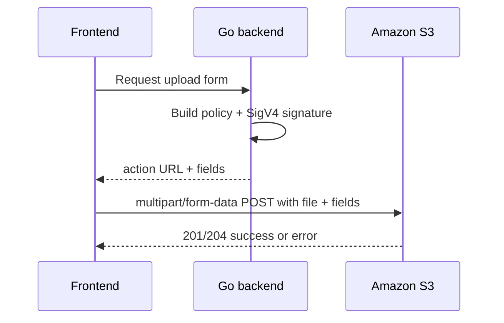

An S3 **POST presigned URL** allows a client (like a web browser) to upload a file directly to an Amazon S3 bucket using an HTML form or a `multipart/form-data` request, without requiring the client to have AWS credentials. 

Unlike a presigned **PUT** URL, which is a single link, a presigned **POST** consists of a URL and a set of required form fields. 

## Key Features : 

1. Granular Control : You can enforce strict policies on the upload, such as limiting the file size (content-length range), file type (content-type), or specifying a required prefix for the key.
2. Browser Compatibility : Specifically designed for HTML forms and direct browser-to-S3 uploads.

## Implementation : 

### step 1 : Sign a URL 

The backend can enforce : 
1. expiration
2. conditions
	1. desired bucket
	2. key prefix
	3. content type
	4. size range using `content-length-range`
	5. metadata
	6. ACL
	7. SigV4 fields

- Here we can `redirect url` that aws will use to redirect after successful upload
- ask for response body.
- 
### step 2 : Return upload instructions : 

A clean backend response looks like this:
- `url` → the S3 form action URL
- `fields` → all hidden form fields the frontend must send

`file` → the actual file goes in a multipart field named `file`

