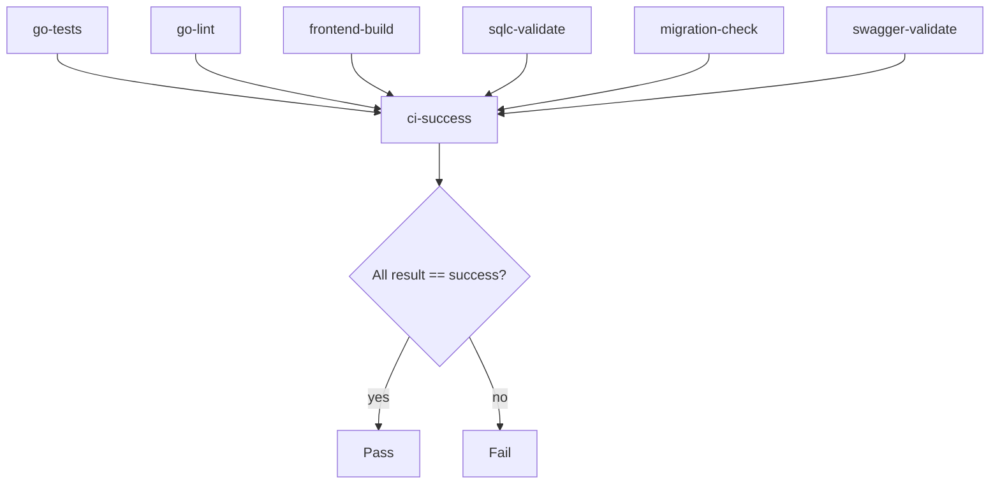

This job is a final gatekeeper. It does not build or test anything itself. It only checks whether all the earlier CI jobs finished successfully.


```yml

# All checks must pass
  ci-success:
      name: CI Success
      runs-on: ubuntu-latest
      needs:
          [
              go-tests,
              go-lint,
              frontend-build,
              sqlc-validate,
              migration-check,
              swagger-validate,
          ]
      if: always()
      steps:
          - name: Check all jobs
            run: |
                if [ "${{ needs.go-tests.result }}" != "success" ] || \
                    [ "${{ needs.go-lint.result }}" != "success" ] || \
                    [ "${{ needs.frontend-build.result }}" != "success" ] || \
                    [ "${{ needs.sqlc-validate.result }}" != "success" ] || \
                    [ "${{ needs.migration-check.result }}" != "success" ] || \
                    [ "${{ needs.swagger-validate.result }}" != "success" ]; then
                  echo "One or more CI checks failed"
                  exit 1
                fi
                echo "All CI checks passed!"
```





## What each parts means ? 


### 1. `needs` : 

```yml
needs:
  [go-tests, go-lint, frontend-build, sqlc-validate, migration-check, swagger-validate]
```

This says: **do not start `ci-success` until all of these jobs have finished**.
It also gives you access to their results through:
```yml
needs.<job_id>.result
example :
- `needs.go-tests.result`
```

```
needs.go-tests.result
needs.go-lint.result
needs.frontend-build.result
needs.sqlc-validate.result
needs.migration-check.result
needs.swagger-validate.result
```
Each one is usually one of these values:
- `success`
- `failure`
- `cancelled`
- `skipped`


### 2. if: always()

This is important.

Normally, if one of the `needs` jobs fails, GitHub would skip downstream jobs.  
`always()` forces this job to run anyway.

So even if `go-tests` fails, `ci-success` still runs and can report the failure clearly.

That makes it a **single summary check** for branch protection.


### 3. script

```bash
if [ "${{ needs.go-tests.result }}" != "success" ] || \
    [ "${{ needs.go-lint.result }}" != "success" ] || \
    [ "${{ needs.frontend-build.result }}" != "success" ] || \
    [ "${{ needs.sqlc-validate.result }}" != "success" ] || \
    [ "${{ needs.migration-check.result }}" != "success" ] || \
    [ "${{ needs.swagger-validate.result }}" != "success" ]; then
  echo "One or more CI checks failed"
  exit 1
fi
echo "All CI checks passed!"
```

This means:
- if **any one** of those jobs is not `success`, fail this job
- otherwise print success

So this job acts like an **AND gate**:
- all must pass → `ci-success` passes
- any one fails → `ci-success` fails

