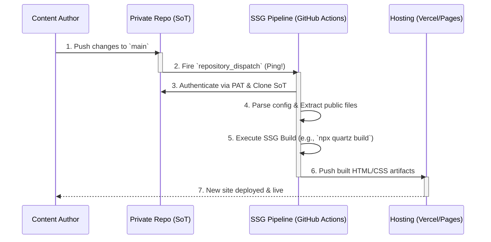

**The Pull-Based Model** is an event-driven publishing pipeline where the presentation layer (the public Static Site Generator repository) assumes full control of the synchronization and build process.

In this architecture, the private Source of Truth (SoT) acts strictly as a database. When updated, it simply sends a lightweight "ping" (a webhook or repository dispatch event) to the public repository. The public repository's CI/CD pipeline then reaches into the private vault, pulls the data, filters it, builds the site, and deploys it.

## Benefits Over the Push-Based Model

While carrying security risks, the Pull-Based pattern offers distinct architectural advantages from a system-design perspective:

- **Strict SRP for the Source of Truth:** The private repository remains incredibly pure. It stores data and fires a generic "I updated" event. It has zero knowledge of GitHub Actions deployment scripts, formatting tools, or the folder structure of the Quartz repository.
    
- **Centralized Build Logic:** All logic related to the website—filtering, routing, layout, and building—lives entirely within the SSG repository. If the Quartz folder structure changes, you only update the CI pipeline within the Quartz repo, leaving the private SoT completely untouched.
    
- **Data Aggregation (The "Hub" Model):** If you eventually have multiple private repositories (e.g., `sot-personal`, `sot-work`, `sot-projects`), the Pull model allows the single public Quartz repository to reach out and pull data from all three simultaneously during its build step.
    

## Architectural Trade-Offs

- **Elevated Security Risk:** This is the primary drawback. To pull data, the public repository's CI/CD environment must hold a Personal Access Token with read-access to your _entire_ private vault. If a malicious actor gains access to your public repo's secrets or modifies the CI workflow in a PR, they can potentially expose or steal your private, unencrypted notes.
    
- **Heavier CI Execution:** The public repository's GitHub Action takes longer to run, as it must clone external repositories, run the filtering scripts, and execute the static site build all in one isolated environment.
    

## Steps for Implementation

To recreate this pipeline, the following components must be established:

1. **Establish Secure Authentication:** Generate a Personal Access Token with read permissions for the private SoT repository. Inject this token into the _public_ SSG repository's secret vault.
    
2. **Configure the Ping (SoT):** In the private SoT repository, create a minimal GitHub Action that listens for a push to `main` and uses the GitHub API to send a `repository_dispatch` event payload to the public repository.
    
3. **Set Up the Listener (Public Repo):** In the public SSG repository, configure a GitHub Action that triggers specifically on that `repository_dispatch` event.
    
4. **Fetch and Filter (Public Repo):** Within that triggered Action, use the PAT to check out the private SoT repository into a temporary directory. Run a script (Bash/rsync or Node.js) to parse the inclusion/exclusion rules and copy the allowed files into the SSG's `content` directory.
    
5. **Build and Deploy:** Once the files are in place, have the Action execute the native build command (e.g., `npx quartz build`) and deploy the static artifacts directly to the hosting provider via their CLI or integration actions.