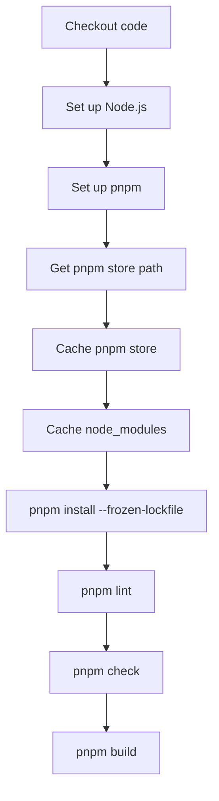

## example 1 :

1. eslint check
2. prettier check 
3. build check

```go
name: CI

on:
  pull_request:
    branches: ["main", "prod", "master"]

  push:
    branches: ["main", "prod", "master"]


env:
  GO_VERSION: "1.24.x"
  NODE_VERSION: "22"

jobs:
  # Frontend Checks
  frontend-build:
        name: Frontend Build
        runs-on: ubuntu-latest
        timeout-minutes: 5

        steps:
            - name: Checkout code
              uses: actions/checkout@v4
            
            - name: Set up Node.js
              uses: actions/setup-node@v4
              with:
                  node-version: ${{ env.NODE_VERSION }}

            - name: Set up pnpm
              uses: pnpm/action-setup@v4
              with:
                  version: 10.11.0

            - name: Get pnpm store directory
              id: pnpm-cache
              shell: bash
              run: echo "STORE_PATH=$(pnpm store path --silent)" >> $GITHUB_OUTPUT

            - name: Cache pnpm store
              uses: actions/cache@v4
              with:
                  path: ${{ steps.pnpm-cache.outputs.STORE_PATH }}
                  key: ${{ runner.os }}-pnpm-store-${{ hashFiles('pnpm-lock.yaml', 'packages/web/package.json') }}
                  restore-keys: |
                      ${{ runner.os }}-pnpm-store-

            - name: Cache node modules
              uses: actions/cache@v4
              with:
                  path: |
                      packages/web/node_modules
                  key: ${{ runner.os }}-node-${{ hashFiles('pnpm-lock.yaml', 'packages/web/package.json') }}
                  restore-keys: |
                      ${{ runner.os }}-node-

            - name: Install dependencies
              working-directory: packages/web
              run: pnpm install --frozen-lockfile

            - name: Run linter
              working-directory: packages/web
              run: pnpm lint

            - name: Check formatting
              working-directory: packages/web
              run: pnpm check

            - name: Build frontend
              working-directory: packages/web
              run: pnpm build
```


### flow : 




1. `actions/checkout@v4` pulls your repository into the GitHub runner so the rest of the job can work on your code.

2. `actions/setup-node@v4` installs the Node.js version from `env.NODE_VERSION`. This gives you the runtime needed for pnpm, linting, and building.

3. `pnpm/action-setup@v4` installs the exact pnpm version you asked for: `10.11.0`. That keeps installs reproducible.
 
4. `pnpm store path --silent` gets the local pnpm content-addressed store location. That store is where pnpm keeps downloaded packages, so caching it speeds up future runs.

5. `actions/cache@v4` for the pnpm store reuses downloaded packages across workflow runs.

6. The `node_modules` cache is a second cache layer for the project’s installed dependencies inside `packages/web/node_modules`.

7. `pnpm install --frozen-lockfile` installs dependencies exactly as locked in `pnpm-lock.yaml`. If the lockfile and package manifest do not match, it fails instead of silently changing versions.

8. `pnpm lint` checks code quality rules.

9. `pnpm check` usually means formatting or type checks, depending on your package scripts.

10. `pnpm build` compiles the frontend for production.


