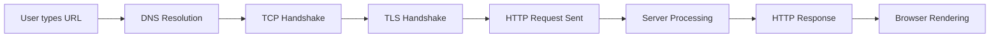
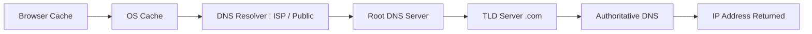

1. **What is HTTP?**
	- HTTP stands for Hypertext Transfer Protocol.
	- It **application-layer protocol** used for communication between clients (like browsers) and servers.
	- It is stateless and works over TCP.
	- Data is sent in plain text which is vernerable to interception.

2. **HTTP request flow :**
	1. Open TCP connection turnnel : 
		1. Three way handshake - 
			1. SYN (synchronize) : The client sends a TCP packet with SYN flag. indicates an intension to connection.
			2. SYN-ACK  (Synchronize-Acknowledgment) The server receives the SYN and responds with a SYN-ACK packet.
			3. ACK (Acknowledgement) : The client receives the SYN-ACK and sends an ACK packet back to the server.
	2. Send request through the tcp turnnel.
		1. contains HTTP method, route, http version, headers and body.
	3. Request processed by the server.
	4. server sends the response to the client.
		1. contains HTTP version, status code, headers, body
	5. Connection is closed with 4 way handshake.
		1. **FIN (Client → Server)**  
		   The client sends a **FIN (Finish)** flag, signaling it has no more data to send.  
		   It then enters the `FIN_WAIT_1` state.
		
		2. **ACK (Server → Client)**  
		   The server receives the FIN and responds with an **ACK**, confirming the request.  
		   - Server enters `CLOSE_WAIT`  
		   - Client enters `FIN_WAIT_2`
		
		1. **FIN (Server → Client)**  
		   After sending all remaining data, the server sends its own **FIN** signal.  
		   It then enters the `LAST_ACK` state.
		
		2. **ACK (Client → Server)**  
		   The client receives the server's FIN and sends a final **ACK**.  
		   It then enters the `TIME_WAIT` state to ensure the ACK was received before fully closing the connection.


3. **HTTP vs HTTPS**
	- HTTPS is http + TLS/SSL.
	- HTTP sends data in plaintext over TCP while HTTPS sends HTTP data through an encrypted, authenticated tunnel created by TLS.


4. **TLS**
	- TLS stands for Transport Layer Security.
	- TLS is a security protocol which creates a secure ternnel after a TCP connection for data communication.
	- **Encryption :** Encrypts data so that only the recipient can read it, and prevents third parties from snopping.
	- **Authentication :** Verifies that you're communicating with the right server and not an imposter using certificates.
	- **Data Integrity :** Ensures that the data has not been tempered or corrupted during transmission.


5. **SSL** : secure socket layer


6. **Structure of HTTP Request & Response**
	- Request :
```go
GET /users HTTP/1.1
Host: example.com
Authorization: Bearer token

<optional body>
```
	- Response
```go
HTTP/1.1 200 OK
Content-Type: application/json

{"id":1}
```

6. **HTTP methods**
	- They are methods defined by HTTP protocol that indicates the desired action a client wants to perform on a specific resource on a server.
		- GET : retrieve data, idempodent, does not have body
		- POST : send data to the server, create operation, not idempodent.
		- PUT : update or replace, if data not exists then create, idempodent.
		- PATCH : partial modification, specific changes
		- DELETE : remove a resource.
		- HEAD : request the headers of a resource without the actual body content.
		- OPTION : 


7. **Status code :**
	- Indicates outcome of the response.
		- 1xx : information response
		- 2xx : successful
		- 3xx : redirection
		- 4xx : client error 
		- 5xx : server error


8. **stateful vs stateless** : 
	- Stateful :
		- The server remembers previous interactions. Context is stored in memory.
			- eg : sticky session LB.
	- Stateless
		- Every request is independent. It contains all the information needed to fulfill it. The server forgets you the moment it sends the response.
		- eg: http


9. **serialization** : 
	- Serialization is the process of converting the state of an object into a form that can be persisted or transported.

10. **What happens when you type a URL?**




11. **DNS resolution:**
	- DNS is a distributed, hierarchical, key-value pair database whose task is to translate human understandable domain name to machine usable IP address.



	DNS resolution follow this chain : 
	1. Application origin: browser, curl, Go, HTTP client
	2. Operating System Resolver
	3. Local DNS cache
	4. OS makes request to Recursive DNS resolver : ISP / public resolver
	5. Root name server
	6. TLD name server (.com, .in, .org)
	7. Authoritative name server : for the domain
	8. IP address returned -> cached -> used for TCP connection.


12. CORS : 
	- Stands for Cross Origin Resource Sharing. 
	- Browser level security and Uses HTTP headers.
	- It allows application at one domain to communicate with application from another domain.
	- It prevent CSRF : client side request  forgery. (prevent where client impersonate)


13. TCP vs UDP
	Both helps to establish connection between the sender and receiver to exchange message  over the internet.
	- TCP : Transpiration Control Protocol
		- TCP establishes a reliable connection between sender and receiver using the **three-way handshake (SYN, SYN-ACK, ACK)** and it uses a **four-step handshake (FIN, ACK, FIN, ACK)** to close connections properly.

| Aspect             | TCP (What it actually means)                               | UDP (What it actually means)   |
| ------------------ | ---------------------------------------------------------- | ------------------------------ |
| Connection         | Before sending data, both sides **establish a connection** | Just send data immediately     |
| Setup              | Uses **3-way handshake** (SYN → SYN-ACK → ACK)             | No setup at all                |
| Reliability        | Keeps track: “Did you receive packet #5?”                  | Doesn’t care if packet is lost |
| Ordering           | If packets arrive 3,1,2 → TCP reorders to 1,2,3            | You get 3,1,2 → your problem   |
| Error recovery     | Lost packet? → resend automatically                        | No resend                      |
| Flow control       | Prevents overwhelming receiver                             | Can flood receiver             |
| Congestion control | Slows down if network is busy                              | Keeps sending blindly          |
| Speed              | Slower (due to checks)                                     | Faster (no checks)             |

