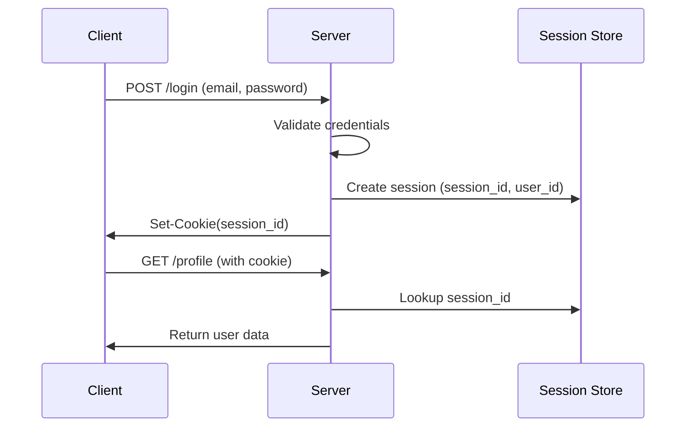
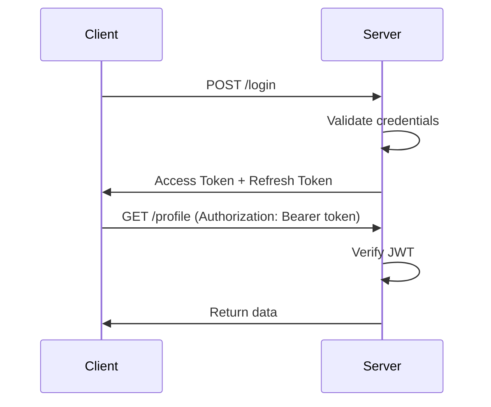

1. **Idempotency :** 
	- Calling/Performing multiple times has the same result as calling/performing it once.

2. **what are the different ways of file upload in backend ?**

	1. Multipart/Form-Data : Direct to Backend
		1. Standard form submissions using `application/x-www-form-urlencoded` can only handle simple key-value pairs.
		2. `multipart/form-data` is essential when you need to upload files, as it efficiently handles binary data.
		3. The client sends the file in chunks as a part of the HTTP request. The backend receives the stream and buffers it either in memory or storage.
		4. Use for small size file to store in the server.
		5. Disadvantages : 
			1. Large file can consume the entire resouce for storing and processing and crash the server.
			2. Introduce malicious files 
			3. slower upload : Lack of parallel chunk upload
			4. No resumable upload : during interruption, the entire process must be restarted.
	
	
	3. Presigned URL directly to object storage (s3, GCS) : 
		1. Instead of the client handing the file to your backend, the client asks your backend for _permission_ to upload. The backend generates a temporary, cryptographically signed URL (e.g., an AWS S3 Presigned URL) and gives it to the client. The client then uploads the file directly to the storage bucket using that URL.

	4. Chunked / Resumable Uploads (e.g., Tus Protocol) :
		1. Chunked and resumable uploads are techniques used to reliably upload large files. They work by ==splitting a file into smaller, manageable "chunks," uploading them independently, and reassembling them on the server==.
		2. Chunks can be stored in memory, storage or object storage.
	5. Base64 Encoded JSON.
		1. The file is converted into a Base64 string and embedded directly into a standard JSON payload alongside other data.
		2. Base64 encoding increases file size by roughly 33%. It requires the entire file to be loaded into memory on both the client and server to encode/decode, making it a severe bottleneck for anything over a few megabytes.

4. **How would you handle file uploads in a web application?**

	1. Server side validation and security: 
		1. validate the size of the file.
		2. check for malicious file.
	2. Use secure channel : HTTPS
	3. avoid name collision : 
	4. store metadata about the file.
	5. idempotency

5. **How would you handle a big file uploads?**
	Directly upload to the object storage service using pre-signed URL. (AWS S3, GCS).
	1. The client sends `POST` request to the server indicating the intension to upload with metadata.
	2. The server validates the request, creates a record in DB with pending status and generates a Pre signed URL.
	3. The client receives the URL and uses it to execute an HTTP `PUT` request, sending the file bytes directly to the object storage. 
	4. Once the object storage successfully receives the file, it triggers an event to the server.
	5. The server updates the record in DB as `completed`.

6. **Types of testing**
	1. Unit test : function level inside the module
	2. Integration test : module level or API level
	3. Load testing, performance testing 

7. **Cycle of Auth Session**

	1. Statefull

	2. Stateless

7. **What is containerization ?**
	1. Conatinerization solves the classical problem : `It works on my machine.`
	2. It’s a lightweight virtualization method to package applications and their dependencies, ensuring consistent environments across different systems.
	3. Benefits : 
		1. Isolate environment.
		2. Scalabilty using docker and K8s
		3. Protablilty and easy to setup the whole applciation by pulling the image

8. **How would you scale a backend application during a traffic surge?**

	1. Scaling the computation layer and database: 
		1. Horizontal Scaling : 
			- You spin up more instances of your application container behind a Load Balancer.
			- Use docker containers and manage using K8s.
	2. Caching and CDNs
		1. Distributed cache
		2. server the static files through CDNs.
	3. Asynchronous Processing :
		Process heavy, non-blocking work like emails, generating invoices, image/video processing asynchronously.
		1. **Message Queues:** The web server simply validate the request, drop a message onto a queue (like RabbitMQ or Kafka), and immediately return a `202 Accepted` to the user.
		2. **Backgorund Wrokers** : dedicated workers pulls the jobs and process them.
	4. Protection : 
		1. Implement rate limiter.
		2. Load shedding : If the server is drowning, it's better to immediately return a `503 Service Unavailable` for 20% of requests than to let 100% of requests time out after 30 seconds.
		3. Circuti Breaker : If an external service or a specific microservice is failing under load, stop sending it traffic. Fail fast. This prevents connection threads in from hanging indefinitely while waiting for a dead service.
	   
9. **What tools and techniques do you use for debugging a backend application?**
	1. Structured Logging
		- Every log entry should include a `request_id`, `user_id`, `timestamp`, and the `level`
	2. Local env: 
		1. Debug tools from IDE .
	3. Database debugging

