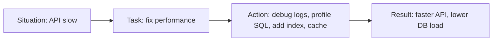

# star method : 

STAR = `Situation → Task → Action → Result`
Structural method used to answer behavioural interview question.
Basically it is 
	**What broke?** → **What was my job?** → **What did I do?** → **What improved?**

## 1. “Tell me about a time you solved a difficult problem.”

### Situation

“Our backend API for fetching user orders started slowing down during peak traffic. The endpoint was taking around 2–3 seconds, and users were complaining about delays.”

### Task

“I was responsible for finding the cause and improving the response time without breaking existing behavior.”

### Action

“I first checked logs and metrics to see where the time was going. Then I profiled the SQL queries and found that one query was doing a full table scan on the orders table. I added the missing index on the filtered column and also cached frequently requested order summaries in Redis to reduce repeated DB hits. After that, I tested the endpoint under load to make sure the fix was stable.”

### Result

“The API response time dropped from about 2.5 seconds to under 300 milliseconds, and the database load reduced significantly during peak hours.”

## 2. Tell me about a time you handled a production issue. (short answer)

During one deployment, our auth service started returning 401 errors for some users. I investigated the token validation flow, found that the refresh token cookie was being sent with the wrong SameSite setting, fixed the cookie configuration, and verified the issue in staging before releasing it. The error rate dropped back to normal and login failures stopped.